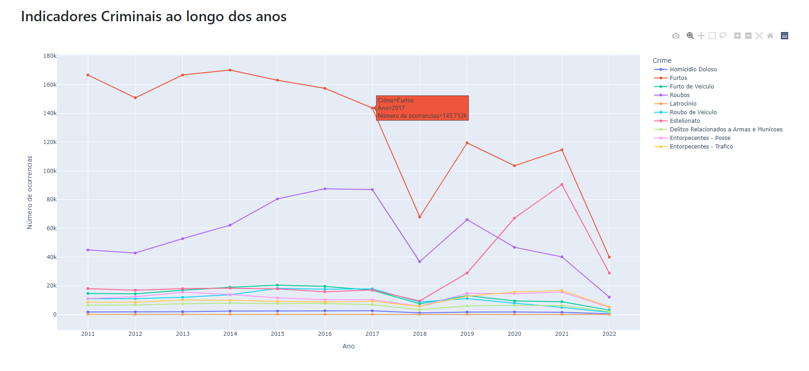
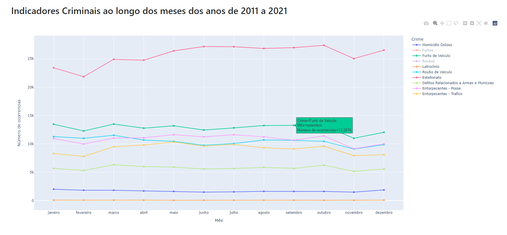
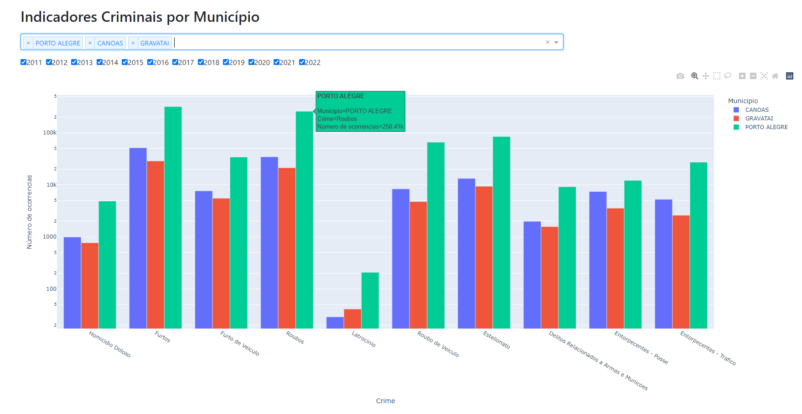
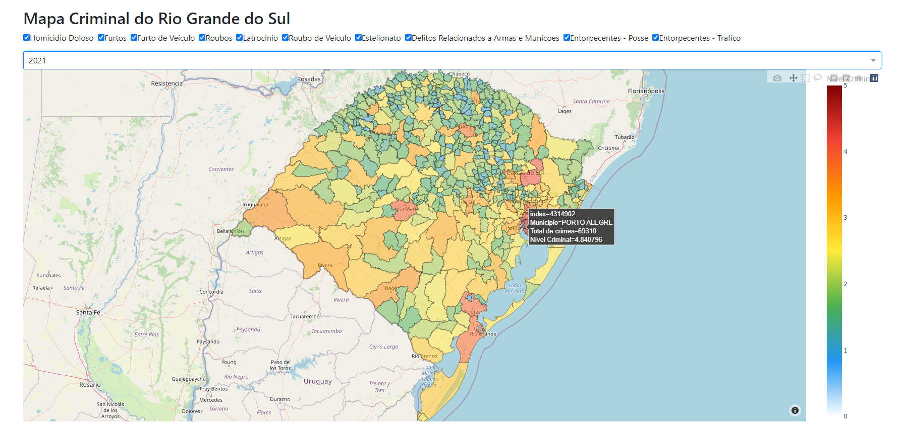
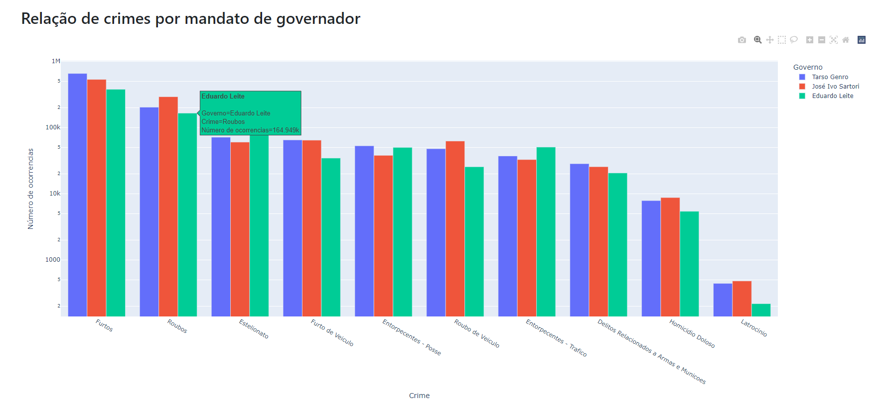

# CrimeRS - An Interactive Dashboard for Visualization of Criminal Data from Rio Grande do Sul
This work addresses the exploration of different interactive visualization techniques using data manipulation and visualization libraries to answer some questions related to crimes committed in the state of Rio Grande do Sul over the years.


## Screenshots


| Criminal Indicators over the years. | Criminal Indicators over the months of the years 2011 to 2021. |
| :------------------------------- | :------------------------------: |
|  |  |

| Criminal Indicators by City. | Crime map of Rio Grande do Sul. |
| :------------------------------- | :------------------------------: |
|  |  |

| List of crimes by term of governor. |
| :------------------------------- |
|  |

## Installation Steps

```bash
  Install python 3.8: https://www.python.org/downloads/
  $ python get-pip.py (or py get-pip.py) 21.0.1
  $ pip install virtualenv
  $ virtualenv virenv --python=3.8
  $ source virenv/bin/activate (or .\virenv\Scripts\activate.bat if you are using Windows)
  (virenv) $ pip install -r requirements.txt
```

## Execution Steps

```bash
  $ source virenv/bin/activate (or .\virenv\Scripts\activate.bat if you are using Windows)
  (virenv) $ python run.py
```

## Technologies Used

- [Python](https://www.python.org/): as main programming language.
- [Plotly](https://plotly.com/): An open-source library that provides a list of chart types as well as tools with callbacks to make a dashboard.
- [Dash](https://dash.plotly.com/): Low-code framework for rapidly building data apps in Python.

## Authors

<table>
  <tr>
    <td align="center">
        <a href="https://github.com/davideclode">
            
            <br />
            <sub><b>Davide da Silva</b></sub>
            <br />
            </a><a title="Code">💻</a>
        </a>
    </td>
    <td align="center">
        <a href="https://github.com/vazaee">
            
            <br />
            <sub><b>Gabriel Vaz</b></sub>
            <br />
            </a><a title="Code">💻</a>
            </a><a title="Design">🎨</a>
        </a>
    </td>
     <td align="center">
        <a href="https://github.com/kinmax">
            
            <br />
            <sub><b>Kin Max</b></sub>
            <br />
            </a><a title="Code">💻</a>
            </a><a title="Design">🎨</a>
        </a>
    </td>
    <td align="center">
        <a href="https://github.com/LuizH12M">
            
            <br />
            <sub><b>Luiz Mosmann</b></sub>
            <br />
            </a><a title="Code">💻</a>
        </a>
    </td>
  <tr>
</table>
